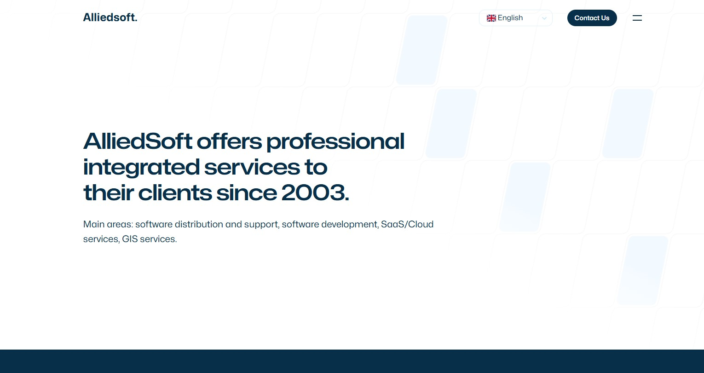
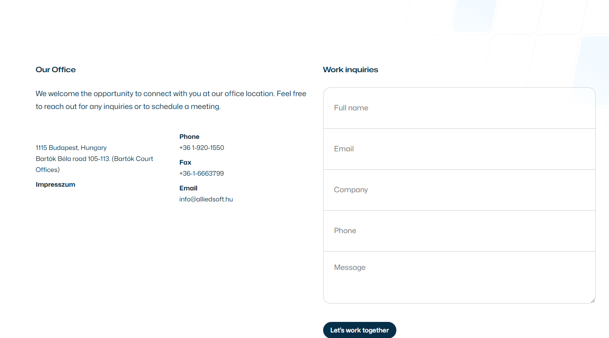
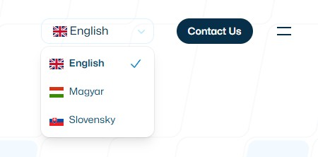

import placeholderPortrait from '@/images/clients/placeholder/placeholderPortrait.jpg'
import useTranslation from '@/app/i18n'

export const article = {
  date: '2025-02-18',
  title: 'Our new website!',
  description:
    'We are excited to announce the launch of our new website! We have been working hard to create a new website that showcases our work and services.',
  author: {
    name: 'Nam Le Thien',
    role: 'Junior Developer',
    image: { src: placeholderPortrait },
  },
}

export const metadata = {
  title: article.title,
  description: article.description,
}

## 1. Updated design

We have updated the design of our website to make it more modern and user-friendly. The new design features a clean and simple layout that is easy to navigate. We have also added new features to make it easier for users to find the information they need.

<TagList>
	<TagListItem>Next.js</TagListItem>
	<TagListItem>TailwindCSS</TagListItem>
	<TagListItem>SEO</TagListItem>
</TagList>

The new design is responsive, which means it looks great on all devices, from desktops to smartphones. We have also optimized the website for speed, so it loads quickly and performs well on all devices.

## 2. New Contact Page

We have added a new contact page to make it easier for users to get in touch with us. The contact page features a contact form that users can fill out to send us a message. We have also added our contact information, including our phone number and email address.

Users can also find our office location on the contact page, along with a map that shows our location. We have made it easy for users to get in touch with us, whether they have a question about our services or want to schedule a consultation.

## 3. Translations

We have added translations to our website to make it more accessible to users who speak different languages. The website is now available in multiple languages, including English, Hungarian.

<TopTip>
  Translate your website to reach a wider audience and attract more customers.
</TopTip>

Users can select their preferred language from the language dropdown menu at the top of the page. We have also added a language switcher to the footer of the website, so users can easily switch between languages.

<Blockquote
	author={{ name:  'Nam Le Thien', role:  'Junior Developer' }}
  image={placeholderPortrait}
>
	"A fresh website is the best way to show off your business and attract new customers."
</Blockquote>